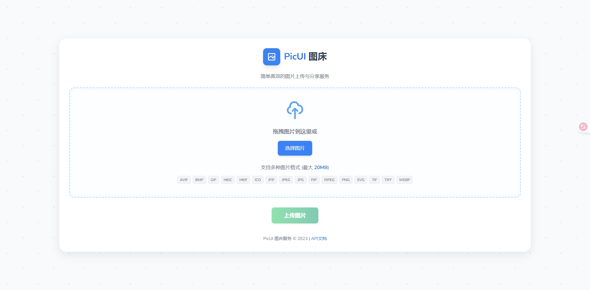
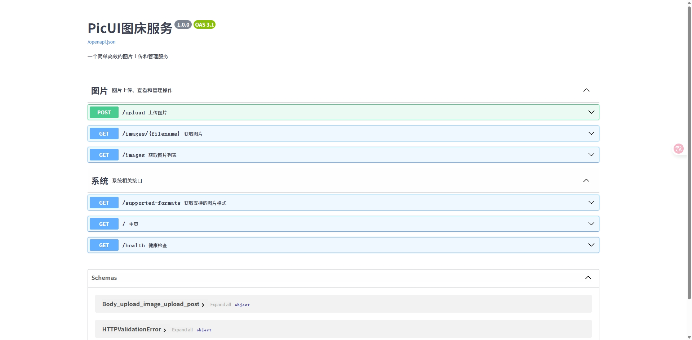

# PicUI 图床服务

PicUI是一个基于FastAPI的简单高效图床服务，支持图片上传、存储、访问和分享。通过简洁的界面和强大的API，让图片管理变得轻松便捷。本项目已移除用户系统，使用更加简洁直观。

🔗 **在线体验**: [测试地址](http://117.72.85.101:8000/)（服务器配置较低，访问可能较慢，请见谅）  
📦 **仓库地址**: [GitHub - laozig/picui](https://github.com/laozig/picui.git)

## 主要功能

- **便捷上传**：支持拖拽上传和API上传
- **多格式支持**：兼容JPG、PNG、GIF、WEBP、BMP、TIFF、SVG、ICO、HEIC等多种图片格式
- **图像处理**：自动优化图片尺寸、添加自定义水印
- **安全可控**：内容安全检测、频率限制
- **分享功能**：短链接生成、临时外链、HTML/Markdown代码生成
- **多色主题**：支持深色、浅色、蓝色、绿色、紫色等多种主题
- **监控统计**：Prometheus指标支持、上传日志记录
- **高性能设计**：多线程处理、异步IO、并发控制
- **部署灵活**：支持Docker、Railway、Render等多种部署方式

## 文档目录

- [使用指南](docs/使用指南.md) - 详细介绍如何使用PicUI图床
- [API文档](docs/API文档.md) - 完整API接口说明和示例
- [服务器部署指南](docs/服务器部署指南.md) - 各种环境下的部署方法
- [环境变量配置](docs/环境变量配置.md) - 所有可配置项说明
- [页面访问权限](docs/页面访问权限.md) - 详细的页面访问路径和权限控制说明

## 预览

### 上传界面


### API界面


## 快速开始

### 安装依赖

```bash
# 创建虚拟环境（可选但推荐）
python -m venv .venv
source .venv/bin/activate  # Linux/Mac
# 或
.venv\Scripts\activate     # Windows

# 安装依赖
pip install -r requirements.txt
```

### 运行服务

```bash
# 方法1：直接运行（开发模式）
python main.py

# 方法2：使用uvicorn（生产环境）
uvicorn src.app:app --host 0.0.0.0 --port 8000 --workers 4
```

访问 http://localhost:8000 打开图床主页。

### API上传示例

```bash
# 使用curl上传图片
curl -X POST "http://localhost:8000/upload" -F "file=@/path/to/image.jpg"
```

Python示例:

```python
import requests

url = "http://localhost:8000/upload"
files = {"file": open("image.jpg", "rb")}

response = requests.post(url, files=files)
print(response.json())
```

## 配置选项

所有配置可通过环境变量或`.env`文件设置:

| 环境变量 | 说明 | 默认值 |
|---------|------|-------|
| `PORT` | 服务端口 | 8000 |
| `HOST` | 服务主机地址 | 0.0.0.0 |
| `BASE_URL` | 基础URL | http://localhost:8000 |
| `UPLOAD_DIR` | 上传目录 | uploads |
| `MAX_FILE_SIZE` | 最大文件大小(字节) | 15MB |
| `WORKERS` | 工作进程数 | CPU核心数+1 |
| `THREAD_POOL_SIZE` | 线程池大小 | CPU核心数*4 |
| `RATE_LIMIT` | 限制请求数/分钟 | 20 |
| `OFFLINE_CHECK_ENABLED` | 启用离线内容检测 | false |

更多配置选项请查看[环境变量配置](docs/环境变量配置.md)文档。

## 图片格式支持

当前支持以下图片格式:

- JPG/JPEG
- PNG
- GIF
- WEBP
- BMP
- TIFF/TIF
- SVG
- ICO
- HEIC/HEIF
- AVIF
- JFIF

## 水印功能

PicUI支持为图片添加文字水印。有两种方式使用水印功能：

### 1. 通过上传界面添加水印（推荐）

在图片上传成功后，您可以在结果页面看到"添加水印"选项。您可以：

1. 自定义水印文字
2. 选择水印位置（右下角、左下角、右上角、左上角或中心）
3. 调整水印不透明度
4. 点击"应用水印"按钮预览带水印的图片
5. 点击"下载水印图片"按钮直接下载带水印的图片

### 2. 通过API地址直接调用

```
/images/{filename}/watermark?text=水印文字&position=bottom-right&opacity=0.5
```

参数说明:
- `text`: 水印文字
- `position`: 位置(center/bottom-right/bottom-left/top-right/top-left)
- `opacity`: 不透明度(0.1-1.0)
- `download`: 是否下载(true/false)

示例：为图片添加居中显示的半透明水印
```
/images/e12a45b7-890c-4d2f-a3b5-6c78d9e0f123.jpg/watermark?text=版权所有&position=center&opacity=0.5
```

## 多线程与异步

PicUI采用多线程和异步设计:

- 使用`ThreadPoolExecutor`处理CPU密集型任务(图片处理、水印等)
- 使用异步IO处理文件上传和网络请求
- 使用信号量控制并发上传数量
- 使用多进程处理HTTP请求(uvicorn workers)

## 部署

### Docker部署

```bash
# 构建镜像
docker build -t picui:latest .

# 运行容器
docker run -d -p 8000:8000 -v ./uploads:/app/uploads --name picui picui:latest
```

### Railway部署

[](https://railway.app/template/picui)

详细部署步骤请参考[服务器部署指南](docs/服务器部署指南.md)。

## 数据持久化

- 图片文件存储在 `uploads/` 目录
- 元数据存储在SQLite数据库 `picui.db`

## 贡献

欢迎提交Issue和Pull Request!

## 许可证

MIT

## 页面访问地址

| 页面名称 | 访问路径 | 说明 | 权限控制 |
|---------|---------|------|---------|
| 主页 | `/` | 上传图片的主界面 | 无限制访问，自动创建会话Cookie |
| 上传日志 | `/logs/` | 查看上传记录 | 仅显示当前会话用户上传的图片记录 |
| 管理面板 | `/admin` | 图片管理和系统设置 | 无限制访问，自动创建会话Cookie |
| 短链接管理 | `/admin/short-links` | 管理短链接 | 仅显示当前会话用户创建的短链接 |

## 会话管理

PicUI使用会话Cookie进行用户身份识别，主要特点：

- 基于安全随机令牌生成唯一会话ID
- 会话有效期为30天
- 定期清理过期会话
- 用户仅能查看和管理自己上传的内容
- 无需注册登录即可使用系统

会话相关环境变量：

| 环境变量 | 说明 | 默认值 |
|---------|------|-------|
| `SESSION_CLEANUP_INTERVAL` | 会话清理间隔（秒） | 3600 |

## 代码清理

项目已清理以下内容：

- 删除了测试文件 (`run_tests.py`, `test_main.py`, `pytest.ini`)
- 删除了测试页面路由 `/test` 和相关模板 `simple_index.html`
- 删除了旧版备份文件 `main.py.old`
- 优化了文件组织结构，移除了未使用的模块

## API接口

### 图片上传

```